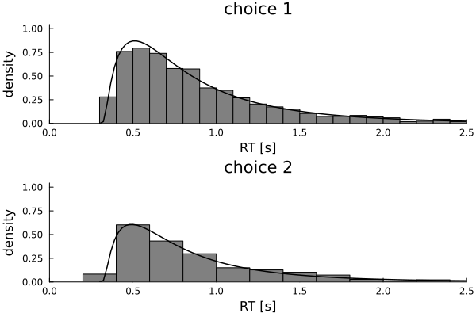

| :exclamation:  Important Note  |
|-----------------------------------------|
This Repo has been decomissioned for SequentialSamplingModels 0.8.0 and higher in favor of conditional loading of plotting functionality. 

# SSMPlots
[](https://itsdfish.github.io/SSMPlots.jl/dev/)

[](https://itsdfish.github.io/SSMPlots.jl/dev/) [](https://github.com/itsdfish/SSMPlots.jl/actions/workflows/CI.yml)

This package provides plotting functionality for sequential sampling models. The code block below provides an example:

```julia 
using SequentialSamplingModels
using SSMPlots
using Random 
Random.seed!(187)

dist = LBA()
histogram(dist; xlims=(0,1.5))
plot!(dist; t_range=range(.301, 1.5, length=100))
```


For more information, please see the documentation link above. Additional examples can be found at [SequentialSamplingModels.jl](https://itsdfish.github.io/SequentialSamplingModels.jl/dev/).
